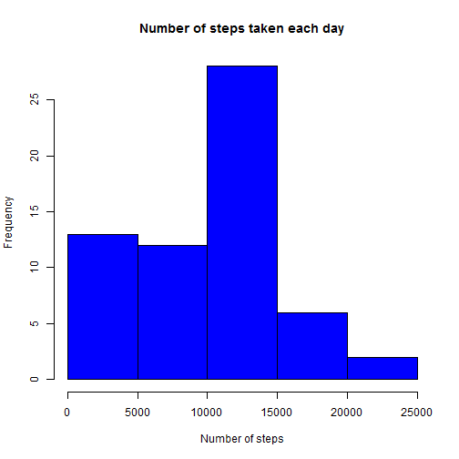
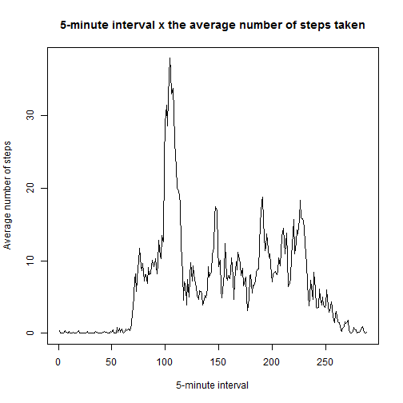
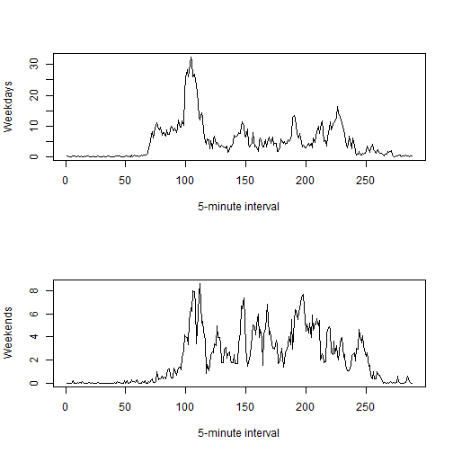

## 1 - Loading and preprocessing the data

In this section, we present the necessary steps to load and preprocessing the data.

Below, we load the data using:


```r
act <- read.csv("activity.csv", sep = ",", header = TRUE)
```

Below, it is showed a sample of the dataset:


```r
head(act)
```

```
##   steps       date interval
## 1    NA 2012-10-01        0
## 2    NA 2012-10-01        5
## 3    NA 2012-10-01       10
## 4    NA 2012-10-01       15
## 5    NA 2012-10-01       20
## 6    NA 2012-10-01       25
```

## 2 - What is mean total number of steps taken per day?

In this section, we will first plot a histogram of the number of steps taken each day and after we will calculate the mean and median of those steps.

### A - Histogram of the total number of steps taken each day

For this task, with first scan the dataset and compute the number of steps for each day, excluding the NA values.


```r
vs <- numeric(length = 0)
rows <- nrow(act)
i <- 1
count <- 0

while(i <= rows){
  date <- act[i, 2]
  n_steps <- 0
  j <- 1
  while(identical(date, act[i,2])){
    if(!is.na(act[i,1])){
      n_steps <- n_steps + act[i,1]
    }
    i <- i + 1
  }
  count <- count + 1
  vs[count] <- n_steps
}
```

Now, we plot the histogram:


```r
hist(vs, col = "blue", xlab = "Number of steps", main = "Number of steps taken each day")
```

 

### B - **Mean** and **median** of the total number of steps taken per day

1 - The general mean is:


```r
mean (vs)
```

```
## [1] 9354.23
```

2 - The general median is:


```r
median (vs)
```

```
## [1] 10395
```

3 - The mean and median per day are obtained by the follow code:


```r
act <- read.csv("activity.csv", sep = ",", header = TRUE)

vmean <- numeric(length = 0)
vmedian <- numeric(length = 0)
rows <- nrow(act)
i <- 1
count <- 0

while(i <= rows){
  date <- act[i, 2]
  vsteps <- numeric(length = 0)
  obs <- 0
  while(identical(date, act[i,2])){
    obs <- obs + 1
    if(!is.na(act[i,1])){
      vsteps[obs] <- act[i,1]
    }else{
      vsteps[obs] <- 0
    }
    i <- i + 1
  }
  count <- count + 1
  vmean[count] <- mean(vsteps)
  vmedian[count] <- median(vsteps)
}
```

The mean by day are:


```r
vmean
```

```
##  [1]  0.0000000  0.4375000 39.4166667 42.0694444 46.1597222 53.5416667
##  [7] 38.2465278  0.0000000 44.4826389 34.3750000 35.7777778 60.3541667
## [13] 43.1458333 52.4236111 35.2048611 52.3750000 46.7083333 34.9166667
## [19] 41.0729167 36.0937500 30.6284722 46.7361111 30.9652778 29.0104167
## [25]  8.6527778 23.5347222 35.1354167 39.7847222 17.4236111 34.0937500
## [31] 53.5208333  0.0000000 36.8055556 36.7048611  0.0000000 36.2465278
## [37] 28.9375000 44.7326389 11.1770833  0.0000000  0.0000000 43.7777778
## [43] 37.3784722 25.4722222  0.0000000  0.1423611 18.8923611 49.7881944
## [49] 52.4652778 30.6979167 15.5277778 44.3993056 70.9270833 73.5902778
## [55] 50.2708333 41.0902778 38.7569444 47.3819444 35.3576389 24.4687500
## [61]  0.0000000
```

The median by day are:


```r
vmedian
```

```
##  [1] 0 0 0 0 0 0 0 0 0 0 0 0 0 0 0 0 0 0 0 0 0 0 0 0 0 0 0 0 0 0 0 0 0 0 0
## [36] 0 0 0 0 0 0 0 0 0 0 0 0 0 0 0 0 0 0 0 0 0 0 0 0 0 0
```


## 3 - What is the average daily activity pattern?

In this sections, we will plot a time series and discover which interval contains the maximum number of steps.

### A - Make a time series plot (i.e. type = "l") of the 5-minute interval (x-axis) and the average number of steps taken, averaged across all days (y-axis)

Using the code below:


```r
vinterval <- vector("numeric", length = 288)
vmean_interval <- vector("numeric", length = 288)

rows <- nrow(act)
i <- 1
count <- 0

while(i <= rows){
  date <- act[i, 2]
  intervals <- 0
  while(identical(date, act[i,2])){
    intervals <- intervals + 1
    if(!is.na(act[i,1])){
      vinterval[intervals] <- vinterval[intervals] + act[i,1]
    }
    i <- i + 1
  }
}

i <- 1
max_intervals <- 288

while(i <= max_intervals){
  vmean_interval[i] <- vinterval[i] / max_intervals
  i <- i + 1
}

min_inter <- c(1:288)
```

We can plot the 5-minute interval x the average number of steps taken:


```r
plot(min_inter, vmean_interval, type = "l", xlab = "5-minute interval", ylab = "Average number of steps", main = "5-minute interval x the average number of steps taken")
```

 

### B - Which 5-minute interval, on average across all the days in the dataset, contains the maximum number of steps?

To answer this questions, we use the code below:


```r
vinterval <- vector("numeric", length = 288)
vmean_interval <- vector("numeric", length = 288)

rows <- nrow(act)
i <- 1
count <- 0

while(i <= rows){
  date <- act[i, 2]
  intervals <- 0
  while(identical(date, act[i,2])){
    intervals <- intervals + 1
    if(!is.na(act[i,1])){
      vinterval[intervals] <- vinterval[intervals] + act[i,1]
    }
    i <- i + 1
  }
}

i <- 1
max_intervals <- 288

while(i <= max_intervals){
  vmean_interval[i] <- vinterval[i] / max_intervals
  i <- i + 1
}

i <- 1
value <-0
the_bigger <- 0

while(i <= max_intervals){
  if(vmean_interval[i] > value){
    value <- vmean_interval[i]
    the_bigger <- i
  }
  i <- i + 1
}
```

And here is the 5-minute interval that contains the maximum number of steps:


```r
## The 5-minute interval that contains the maximum number of steps:
the_bigger
```

```
## [1] 104
```

```r
## Its value:
value
```

```
## [1] 37.94097
```

To find what time is it in the day, we use the code below:


```r
## To find de number of hours, we divide the_bigger for 12, since every hour has 12 of 5 minutes
hour <- the_bigger %/% 12

## Then, we calculate the modulus to find the remainder. The remainder means "how many 5 minutes remains"
rem <- the_bigger %% 12

## And, we multiply the remainder by 5, to find the amount of minutes
minutes <- rem * 5

## Thus, we can paste all together, to find the time in the day
paste("Time: ", hour, ".", minutes, sep = "")
```

```
## [1] "Time: 8.40"
```

## 4 - Inputing missing values

In this section, we will deal with four tasks, as described below:

### A - Calculate and report the total number of missing values in the dataset (i.e. the total number of rows with NAs)

Using the code below:


```r
rows <- nrow(act)
count <- 0

for(i in 1:rows){
    if(is.na(act[i,1])){
      count <- count + 1
    }
}
```

The number of missing values is:


```r
count
```

```
## [1] 2304
```

### B - Devise a strategy for filling in all of the missing values in the dataset. The strategy does not need to be sophisticated. For example, you could use the mean/median for that day, or the mean for that 5-minute interval, etc.


```r
#
# We use this previous code below to demonstrate our strategy
#

vinterval <- vector("numeric", length = 288)
vmean_interval <- vector("numeric", length = 288)

rows <- nrow(act)
i <- 1
count <- 0

while(i <= rows){
  date <- act[i, 2]
  intervals <- 0
  while(identical(date, act[i,2])){
    intervals <- intervals + 1
    if(!is.na(act[i,1])){
      vinterval[intervals] <- vinterval[intervals] + act[i,1]
    }
    i <- i + 1
  }
}

i <- 1
max_intervals <- 288

while(i <= max_intervals){
  vmean_interval[i] <- vinterval[i] / max_intervals
  i <- i + 1
}


#
# From here, we devise our stragety to NA values.
# Our strategy consists of applying the mean of 5-minute interval across all days in the
# respective 5-minute missing value. Basically, we create a new vector called steps[],
# where if the value is not # NA, the vector receive the own value. If the value is missing 
# (NA), the vector receives the the mean of 5-minute interval across all days, which is stored
# in vmean_interval []
#

library(dplyr)

steps <- vector("numeric")
i <- 1

while(i <= rows){
  date <- act[i, 2]
  intervals <- 0
  while(identical(date, act[i,2])){
    intervals <- intervals + 1
    if(!is.na(act[i,1])){
      steps[i] <- act[i,1]
    }else{
      steps[i] <- vmean_interval[intervals]
    }
    i <- i + 1
  }
}

# At this point, the vector steps[] contains the column "steps" with our values filled.
```

### C - Create a new dataset that is equal to the original dataset but with the missing data filled in.

From the previous code, now we create the new dataset called act2:


```r
act2 <- cbind(steps, select(act, -steps))

head(act2, 20)
```

```
##         steps       date interval
## 1  0.31597222 2012-10-01        0
## 2  0.06250000 2012-10-01        5
## 3  0.02430556 2012-10-01       10
## 4  0.02777778 2012-10-01       15
## 5  0.01388889 2012-10-01       20
## 6  0.38541667 2012-10-01       25
## 7  0.09722222 2012-10-01       30
## 8  0.15972222 2012-10-01       35
## 9  0.00000000 2012-10-01       40
## 10 0.27083333 2012-10-01       45
## 11 0.05555556 2012-10-01       50
## 12 0.02430556 2012-10-01       55
## 13 0.05902778 2012-10-01      100
## 14 0.12500000 2012-10-01      105
## 15 0.02777778 2012-10-01      110
## 16 0.06250000 2012-10-01      115
## 17 0.00000000 2012-10-01      120
## 18 0.20486111 2012-10-01      125
## 19 0.33680556 2012-10-01      130
## 20 0.03125000 2012-10-01      135
```

### D - Make a histogram of the total number of steps taken each day and Calculate and report the mean and median total number of steps taken per day. Do these values differ from the estimates from the first part of the assignment? What is the impact of imputing missing data on the estimates of the total daily number of steps?

We will follow all the steps from the assignment 1, but now using the new datasec act2.

### A - Histogram of the total number of steps taken each day

We first scan the dataset and compute the number of steps for each day.


```r
vs2 <- numeric(length = 0)
rows <- nrow(act2)
i <- 1
count <- 0

while(i <= rows){
  date <- act2[i, 2]
  n_steps <- 0
  j <- 1
  while(identical(date, act2[i,2])){
    if(!is.na(act2[i,1])){
      n_steps <- n_steps + act2[i,1]
    }
    i <- i + 1
  }
  count <- count + 1
  vs2[count] <- n_steps
}
```

Now, we plot the histogram:


```r
hist(vs2, col = "blue", xlab = "Number of steps", main = "New number of steps taken each day")
```

 

### B - **Mean** and **median** of the total number of steps taken per day

1 - The general mean is:


```r
mean (vs2)
```

```
## [1] 9614.069
```

2 - The general median is:


```r
median (vs2)
```

```
## [1] 10395
```

3 - The mean and median per day are obtained by the follow code:


```r
vmean <- numeric(length = 0)
vmedian <- numeric(length = 0)
rows <- nrow(act2)
i <- 1
count <- 0

while(i <= rows){
  date <- act2[i, 2]
  vsteps <- numeric(length = 0)
  obs <- 0
  while(identical(date, act2[i,2])){
    obs <- obs + 1
    if(!is.na(act2[i,1])){
      vsteps[obs] <- act2[i,1]
    }else{
      vsteps[obs] <- 0
    }
    i <- i + 1
  }
  count <- count + 1
  vmean[count] <- mean(vsteps)
  vmedian[count] <- median(vsteps)
}
```

The mean by day are:


```r
vmean
```

```
##  [1]  6.8794367  0.4375000 39.4166667 42.0694444 46.1597222 53.5416667
##  [7] 38.2465278  6.8794367 44.4826389 34.3750000 35.7777778 60.3541667
## [13] 43.1458333 52.4236111 35.2048611 52.3750000 46.7083333 34.9166667
## [19] 41.0729167 36.0937500 30.6284722 46.7361111 30.9652778 29.0104167
## [25]  8.6527778 23.5347222 35.1354167 39.7847222 17.4236111 34.0937500
## [31] 53.5208333  6.8794367 36.8055556 36.7048611  6.8794367 36.2465278
## [37] 28.9375000 44.7326389 11.1770833  6.8794367  6.8794367 43.7777778
## [43] 37.3784722 25.4722222  6.8794367  0.1423611 18.8923611 49.7881944
## [49] 52.4652778 30.6979167 15.5277778 44.3993056 70.9270833 73.5902778
## [55] 50.2708333 41.0902778 38.7569444 47.3819444 35.3576389 24.4687500
## [61]  6.8794367
```

The median by day are:


```r
vmedian
```

```
##  [1] 6.277778 0.000000 0.000000 0.000000 0.000000 0.000000 0.000000
##  [8] 6.277778 0.000000 0.000000 0.000000 0.000000 0.000000 0.000000
## [15] 0.000000 0.000000 0.000000 0.000000 0.000000 0.000000 0.000000
## [22] 0.000000 0.000000 0.000000 0.000000 0.000000 0.000000 0.000000
## [29] 0.000000 0.000000 0.000000 6.277778 0.000000 0.000000 6.277778
## [36] 0.000000 0.000000 0.000000 0.000000 6.277778 6.277778 0.000000
## [43] 0.000000 0.000000 6.277778 0.000000 0.000000 0.000000 0.000000
## [50] 0.000000 0.000000 0.000000 0.000000 0.000000 0.000000 0.000000
## [57] 0.000000 0.000000 0.000000 0.000000 6.277778
```


Analysing the histograms, the figures are different, but the impact in the form is not but the impact in the form is not clearly sensitive. However, the mean and the meadian is clearly different. So, we conclude that NA values have a meaningful impact on the data.


## 5 - Are there differences in activity patterns between weekdays and weekends?

For this assigment, we will perform two tasks, as described below:

### A - Create a new factor variable in the dataset with two levels -- "weekday" and "weekend" indicating whether a given date is a weekday or weekend day.


```r
#
# First, we create a vector to receive the factos "weekday" and "weekend", acording to the 
# result of the function wday(). 
#

library(lubridate)

i <- 1
days <- vector()

while(i <= rows){
  date <- wday(act2[i, 2])
  if( date == 1){
    days[i] <- "Weekend"
  }else if( date == 7){
    days[i] <- "Weekend"
  }else{
    days[i] <- "Weekday"
  }
    i <- i + 1
}

#
# And then, we put the new variable in the dataset act2
#
act2 <- cbind(act2, days)
```

See below a sample of the dataset act2 with the new variable:


```r
head(act2, 20)
```

```
##         steps       date interval    days
## 1  0.31597222 2012-10-01        0 Weekday
## 2  0.06250000 2012-10-01        5 Weekday
## 3  0.02430556 2012-10-01       10 Weekday
## 4  0.02777778 2012-10-01       15 Weekday
## 5  0.01388889 2012-10-01       20 Weekday
## 6  0.38541667 2012-10-01       25 Weekday
## 7  0.09722222 2012-10-01       30 Weekday
## 8  0.15972222 2012-10-01       35 Weekday
## 9  0.00000000 2012-10-01       40 Weekday
## 10 0.27083333 2012-10-01       45 Weekday
## 11 0.05555556 2012-10-01       50 Weekday
## 12 0.02430556 2012-10-01       55 Weekday
## 13 0.05902778 2012-10-01      100 Weekday
## 14 0.12500000 2012-10-01      105 Weekday
## 15 0.02777778 2012-10-01      110 Weekday
## 16 0.06250000 2012-10-01      115 Weekday
## 17 0.00000000 2012-10-01      120 Weekday
## 18 0.20486111 2012-10-01      125 Weekday
## 19 0.33680556 2012-10-01      130 Weekday
## 20 0.03125000 2012-10-01      135 Weekday
```

### B - Make a panel plot containing a time series plot (i.e. type = "l") of the 5-minute interval (x-axis) and the average number of steps taken, averaged across all weekday days or weekend days (y-axis). The plot should look something like the following, which was created using simulated data:

We use the code below to prepare the data to plot:


```r
max_intervals <- 288

vinterval_weekdays <- vector("numeric", length = max_intervals)
vinterval_weekends <- vector("numeric", length = max_intervals)
vmean_interval_weekdays <- vector("numeric", length = max_intervals)
vmean_interval_weekends <- vector("numeric", length = max_intervals)

rows <- nrow(act2)
i <- 1

while(i <= rows){
  date <- act2[i, 2]
  intervals <- 0
  while(identical(date, act2[i,2])){
    intervals <- intervals + 1
    if(identical("Weekday", as.character(act2[i,4]))){
      vinterval_weekdays[intervals] <- vinterval_weekdays[intervals] + act2[i,1]
    }else{
      vinterval_weekends[intervals] <- vinterval_weekends[intervals] + act2[i,1]
    }
    i <- i + 1
  }
}

i <- 1

while(i <= max_intervals){
  vmean_interval_weekdays[i] <- vinterval_weekdays[i] / max_intervals
  vmean_interval_weekends[i] <- vinterval_weekends[i] / max_intervals
  i <- i + 1
}

min_inter <- c(1:288)
```

And now, we can plot the data, according to the specified:

 
